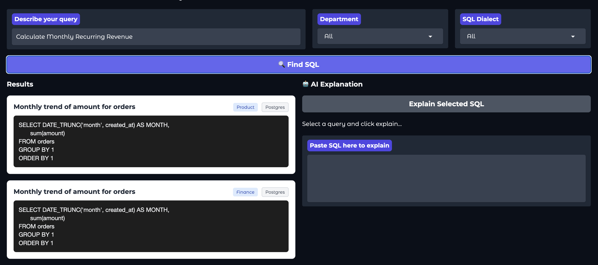
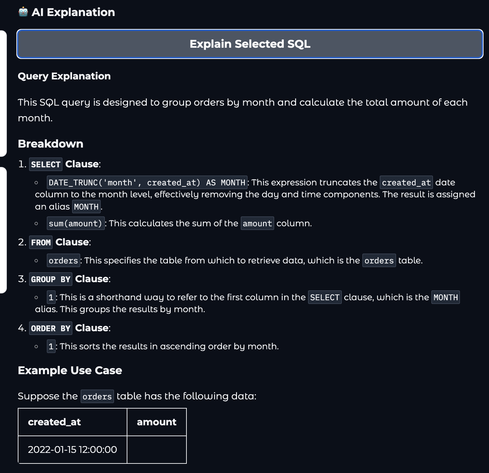

# SemantiSQL: RAG-Based SQL Retriever & AI Explainer

**A Semantic Search Engine for Enterprise SQL Repositories.**
*Stop rewriting queries. Start retrieving them.*

[**🚀 Live Demo**](https://www.google.com/search?q=https://huggingface.co/spaces/harrykesh/SemantiSQL) 

-----

## 📖 Overview

In large data organizations, analysts and engineers often waste time rewriting complex SQL queries that already exist in the codebase. Traditional keyword search (Ctrl+F "revenue") fails when column names don't match human intent (e.g., searching for "money" vs `sum(total_amt)`).

**SemantiSQL** solves this using **Retrieval-Augmented Generation (RAG)** technology. It indexes thousands of SQL queries by their *semantic meaning* (vector embeddings) rather than just keywords, allowing users to find the code they need using natural language.

Key capabilities:

  * **Semantic Search:** Finds queries based on intent (e.g., "Find high value users" -\> `SELECT * FROM users WHERE LTV > 1000`).
  * **Metadata Filtering:** Narrow search results by **Department** (Finance, Sales, DevOps) or **SQL Dialect** (Postgres, Snowflake).
  * **AI Explanation:** Uses **Meta Llama 3** to analyze retrieved SQL and explain the logic in plain English to non-technical users.
  * **Synthetic Data Pipeline:** Includes a custom generator that creates thousands of realistic, diverse SQL scenarios for testing.

-----

## ⚙️ Architecture

The system is built on a "Retriever-Reader" RAG architecture:

1.  **Ingestion:** A Python script generates/loads SQL queries and converts their descriptions into vector embeddings using `sentence-transformers/all-MiniLM-L6-v2`.
2.  **Storage:** Vectors and metadata (Dialect, Department) are stored in **ChromaDB**, a local vector database.
3.  **Retrieval:** When a user searches, their query is embedded and compared against the database using Cosine Similarity.
4.  **Generation:** The user can select a retrieved query and pass it to **Llama-3-8B-Instruct** (via Hugging Face Inference API) for a step-by-step explanation.

-----

## 🛠️ Tech Stack

  * **Frontend:** [Gradio](https://gradio.app/) (Python-based UI).
  * **Vector Database:** [ChromaDB](https://www.trychroma.com/) (Persistent vector storage).
  * **Embeddings:** `all-MiniLM-L6-v2` (via Sentence-Transformers).
  * **LLM Integration:** `huggingface_hub` (Inference Client for Llama 3).
  * **Data Processing:** Pandas & SQLParse (for code beautification).
  * **Hosting:** Hugging Face Spaces (CPU Basic).

-----

## 🚀 Installation & Local Setup

**1. Clone the Repository**

```bash
git clone https://github.com/yourusername/SemantiSQL.git
cd SemantiSQL
```

**2. Create a Virtual Environment**

```bash
python -m venv venv
source venv/bin/activate  # On Windows: venv\Scripts\activate
```

**3. Install Dependencies**

```bash
pip install -r requirements.txt
```

**4. Set Up Environment Secrets**
You need a Hugging Face Access Token to use the Llama 3 model for explanations.

  * Create a `.env` file or export the variable in your terminal:

<!-- end list -->

```bash
export HF_TOKEN="your_huggingface_write_token_here"
```

**5. Run the App**

```bash
python app.py
```

*The app will launch locally at `http://127.0.0.1:7860`.*

-----

## 🧠 Synthetic Data Generation

To simulate a real-world enterprise environment, this project includes a **Synthetic Data Generator** (`generate_data.py`).

Instead of manually writing SQL, the script uses template randomization to generate 2,000+ unique SQL queries across:

  * **6 Departments:** Finance, Growth, DevOps, Sales, HR, Product.
  * **3 Dialects:** Postgres, Snowflake, BigQuery.
  * **5 Query Types:** Aggregation, Time-series, Filters, Joins, Data Cleaning.

To regenerate fresh data:

```bash
python generate_data.py
```

-----

## 📸 Screenshots

### 1\. Semantic Search with Filters



### 2\. AI Code Explanation



-----

## 🤝 Contributing

Contributions are welcome\! Please open an issue or submit a pull request for any bugs or features.

## 📄 License

MIT License
